# 便携版 foobar2000 安装 / 转码 / 使用 教程

- [安装 foobar2000 和相关编解码组件](#安装-foobar2000-和相关编解码组件)
  * [可选安装额外解码器](#可选安装额外解码器)
- [转码配置](#转码配置)
  * [配置 FLAC 预设](#配置-flac-预设)
  * [配置 WavPack 预设](#配置-wavpack-预设)
  * [配置 AAC 预设](#配置-aac-预设)
  * [预设汇总](#预设汇总)
- [使用方法](#使用方法)
  * [编辑 Metadata](#编辑-metadata)
  * [比较音轨](#比较音轨)
  * [移除内嵌播放列表](#移除内嵌播放列表)
  * [TAK 解码](#TAK-解码)

## 安装 foobar2000 和相关编解码组件

1. 下载 [foobar2000](https://www.foobar2000.org/download) 安装程序, 选择 **64-bit** 版

2. 打开安装程序, 选择移动版安装模式 **Portable Installation**  
    指定安装路径时如果使用非默认路径, 记得先新建一个 foobar2000 根目录

    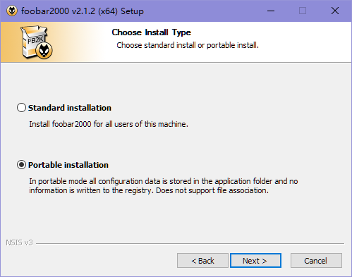

3. `Components` 选择 `Full`, 多次点击确定后完成安装

    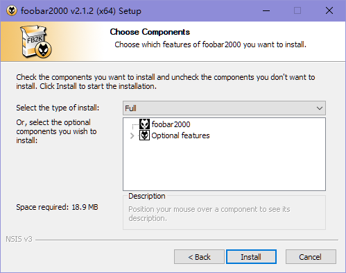

4. 下载编码器包 [foobar2000 Free Encoder Pack](https://www.foobar2000.org/encoderpack)  
    选择先前安装 foobar2000 的路径, `Encoders` 选择 `All`

    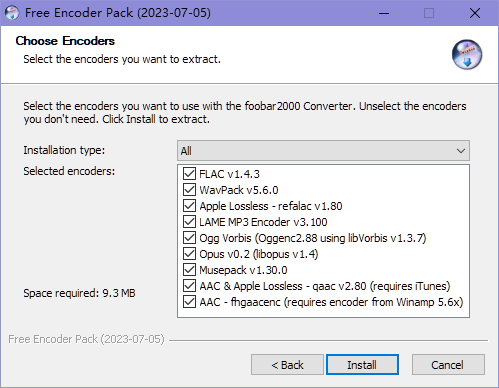

### 可选安装额外解码器

5. 下载额外解码器 [TrueHD decoder](https://sourceforge.net/projects/dvdadecoder/files/foo_input_dvda/) + [DSD decoder](https://sourceforge.net/projects/sacddecoder/files/foo_input_sacd/) + [TTA decoder](https://www.foobar2000.org/components/view/foo_input_tta), 解压得到 `.fb2k-component` 文件

6. 打开 foobar2000, 点击菜单栏 [`File`] - [`Preferences`]

    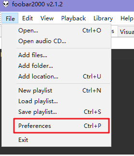

    进入界面后左侧选择 [`Components`], 点击下方 [`Install`] 选择上一步得到的 `.fb2k-component` 文件, 最后点击 [`OK`] 进行安装  
    此时 foobar2000 会要求重启, 点击确认, 重启后完成安装

    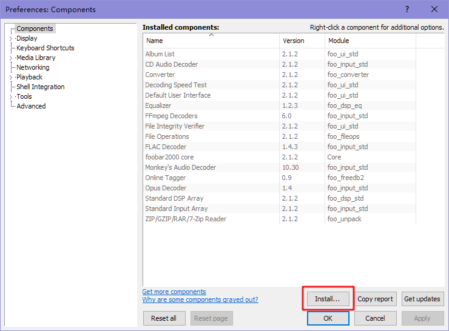

### 备注

foobar2000 v2.0 以上版本原生支持以下格式的解码:  `WAV(PCM)`/`FLAC`/`ALAC`/`WAVPACK`/`APE`/`TAK`/`DTS-HD MA(没有进度条, 只能从头播)`/`DTS`/`AC-3`/`E-AC-3`/`AAC`/`MP3`

如果需要播放 `DTS-HD MA` 时拖动进度条, 可以下载 [旧版 foobar2000](https://www.foobar2000.org/getfile/foobar2000_v1.6.17.exe) (多数格式无原生解码支持), 并安装 [DTS decoder](https://www.foobar2000.org/components/view/foo_input_dts) (无法在 foobar2000 v2.0 以上版本安装) 后进行播放

## 转码配置

### 配置 FLAC 预设

1. 随便在 foobar2000 中打开一首歌, 然后右键打开菜单, 选择 [`Convert`] - [`...`]

    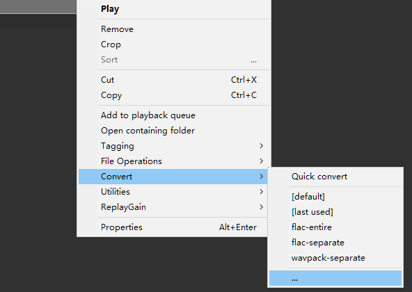

2. 进入 Converter Setup 界面, 这里左边是预设, 右边是具体配置  
    第一次设置时, 我们直接操作右边, 点击右边第一个 `Output format`, 进行输出格式的配置

    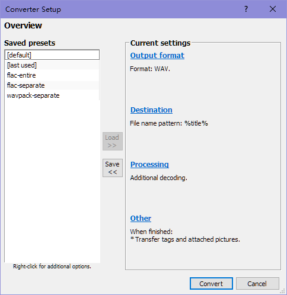

3. 进入 Output format 界面, 确保 `Output bit depth` 是 `Auto`, `Dither` 是 `never`, 然后双击 FLAC 一行

    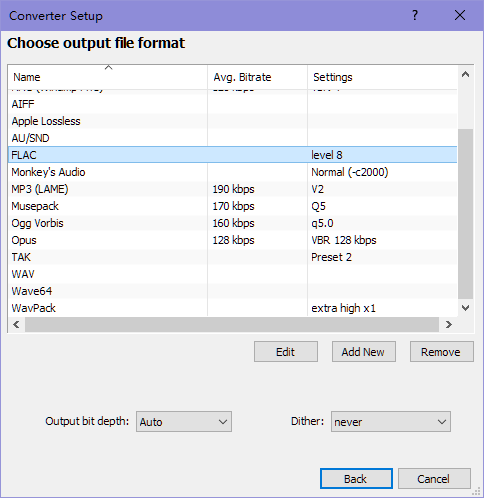

4. FLAC 界面里, 把唯一的进度条拉到最右, 此时界面中间显示压缩等级为最高 `8`, 然后点击 `OK`

    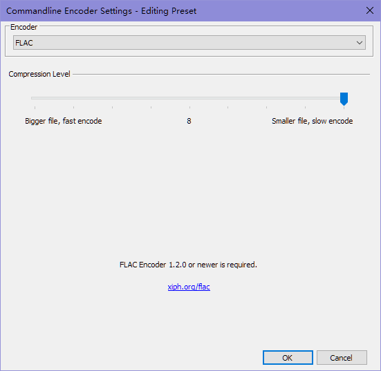

5. 点击 `Back`, 回到 Converter Setup 界面, 点击右边第二个 `Destination`, 进行输出文件名的配置

6. 进入 Destination 界面, 点击图里红圈的 `...`

    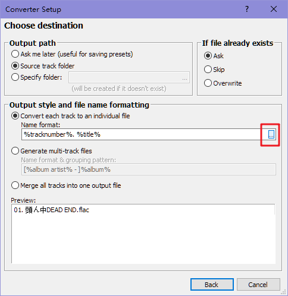

7. 此时会看到一排预设, 左边是子文件夹名模板, 选择 `<none>` 就是不创建子文件夹  
    右边是文件名模板, 第一个红圈是保持输入文件名, 用于整轨转码; 第二个红圈是按轨道序号和轨道名称命名, 用于分轨转码  
    这里我们先选用于整轨转码的模板, 选好后直接关掉预设界面

    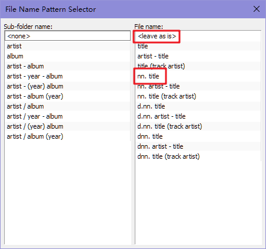

8. 回到 Destination 界面, 点击 `Back` 回到 Converter Setup 界面  
    现在我们配置好了输出格式和输出文件名, 其他配置保持默认即可, 随后点击中间的 `Save` 保存预设  

    对于 FLAC, 我们需要保存用于整轨和分轨的两组预设  
    现在, 回到步骤 6, 选择用于分轨转码的模板, 保存用于分轨的另一组预设

### 配置 WavPack 预设

1. WavPack 配置和 FLAC 类似, 在 Output format 界面双击 WavPack 一行  
    将第一个进度条拉到最右, 中间显示 `extra high`  
    将第二个进度条拉到 `1` ( 2 和 3 也可以, 但编码速度递减, 4 以及往后的选项有兼容性问题, 务必避免使用)

    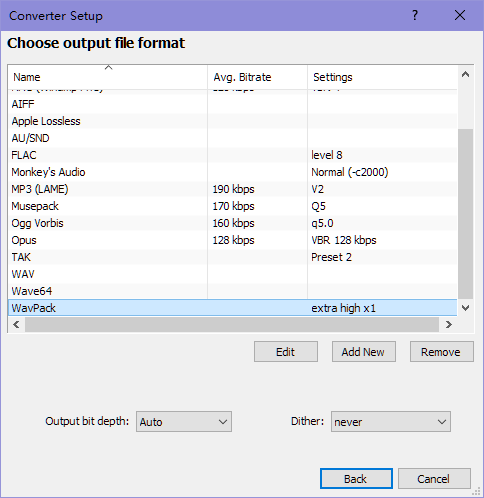  
    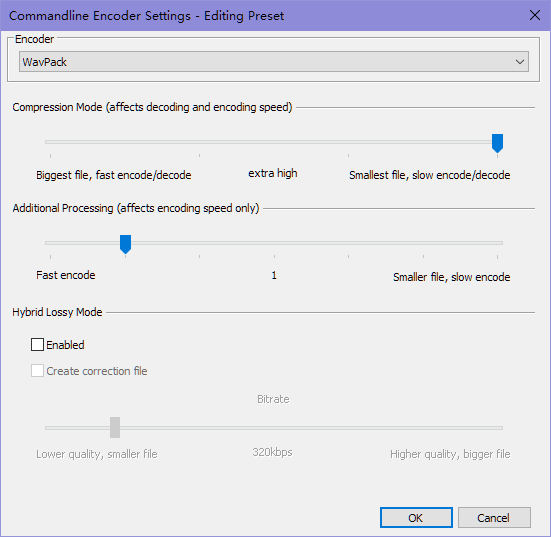

2. 需要使用 WavPack 转码的情况都是 Hi-Res 专辑, 因此 Destination 部分只需要按分轨配置即可

### 配置 AAC 预设

1. AAC 配置需要在 Converter Setup 界面点击 `Add New`

    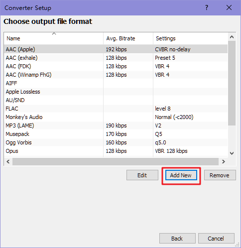

2. 进入界面, 在 `Encoder` 下拉菜单中选择最后一个 `Custom`

    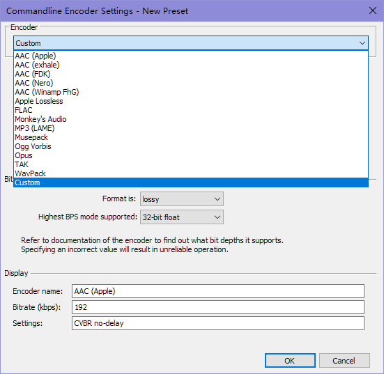

3. `Encoder file` 填写 OKEGui portable 中附带的 qaac64.exe 的完整路径  
    `Extension` 填写 `m4a`  (别写 `aac` 转码会报错)  
    `Parameters` 填写 `-i -q 2 -v 192 --no-delay -o %d -`  
    其余部分如图设置, `Display` 区域按你喜好填, 建议填成图里这样

    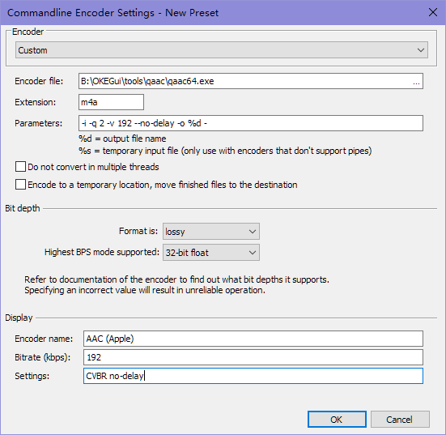

4. 需要使用 AAC 转码的情况都是原盘音轨, 不用关心输出文件名, 因此 Destination 部分只需要按整轨配置即可

### 预设汇总

1. 最后保存好的预设应该有四个: `FLAC 整轨转码` / `FLAC 分轨转码` / `WavPack 分轨转码` / `AAC no-delay 整轨转码`

    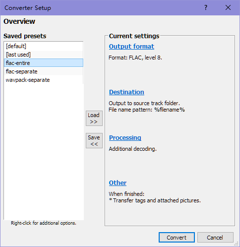  
    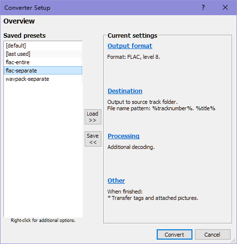  
    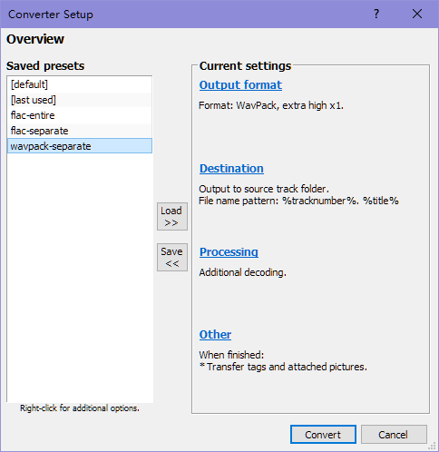  
    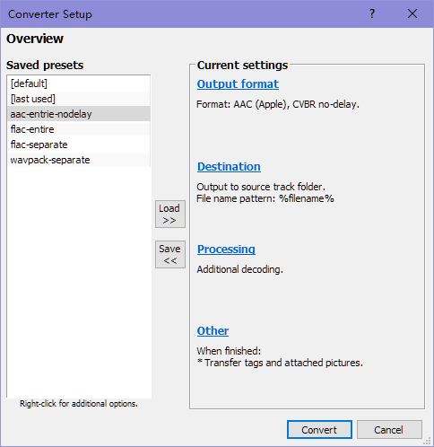  

2. 需要转码时, 右键打开菜单, 选择 [`Convert`] 后点击对应预设即可完成转码

## 使用方法

### 编辑 Metadata

1. 在 foobar2000 中选中想要编辑 Metadata 的曲目 (可以多选), 然后右键打开菜单, 点击 [`Properties`]

    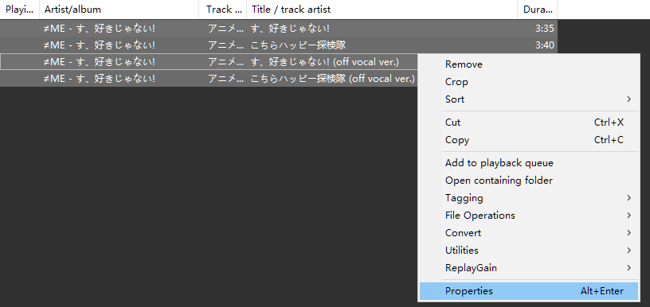

2. 进入 Properties 界面, 各行可以用鼠标拖曳多选, 也可以按住 shift 或者 ctrl 进行多选  
    Comment 及后续行是整理中分轨以及整轨 cue 不需要的多余信息, 选中后按 delete 就可以一键删除  
    对于整轨文件, 需要保证此界面内没有任何数据, 全部选中后 delete 即可

    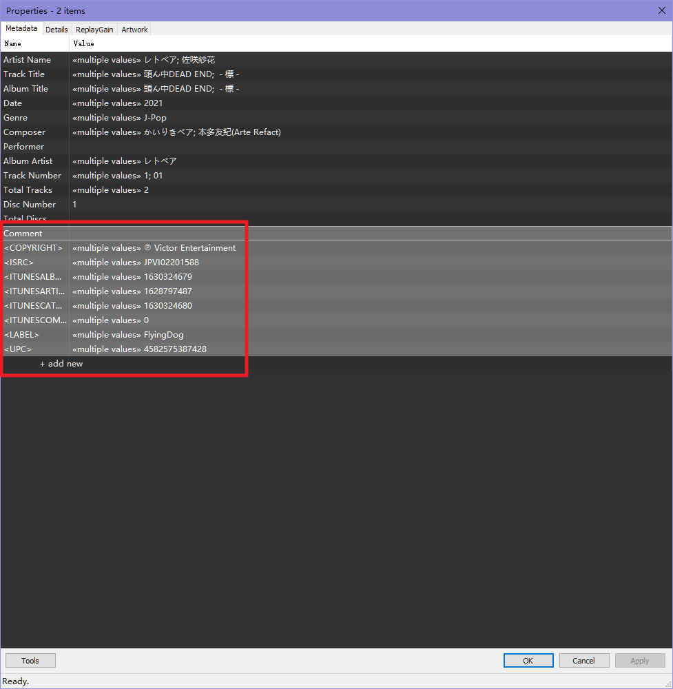

3. 点击右侧 Value 格子就可以修改左侧对应 field 的数据, 如果是多选曲目的 Properties 界面, 此时输入的内容会同时修改所有文件的对应 field 数据

    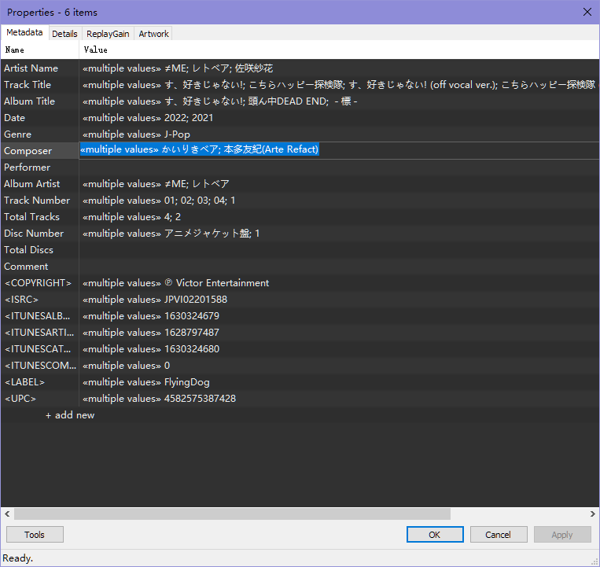

4. 如果想在多选曲目的同时, 单独修改某一曲目的特定 field, 可以双击左侧 Name 列对应 field, 进入单独的 field 编辑界面, 编辑好之后点 `OK` 退出  
    该窗口可以使用 `Ctrl+A` 全选, `Ctrl+C` 复制所有 Value 中的值, 之后可以粘贴到文本编辑器中进行批量操作; 编辑后的信息同样复制, 在该窗口中 `Ctrl+A` 全选, `Ctrl+V` 粘贴即可完成编辑

    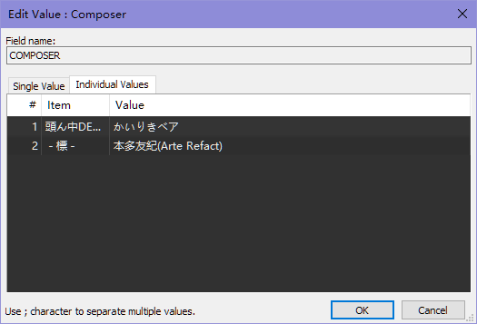

5. 另外, 点击左下 `Tools` 按钮, 可以看到 `Auto Track Number` (多选曲目时才有), 可以给你选中的曲目自动生成顺序和总曲目数  
    当遇到序号补零的情况时 (例如 01, 02...), 最好也要进行该操作以消除多余的 0

    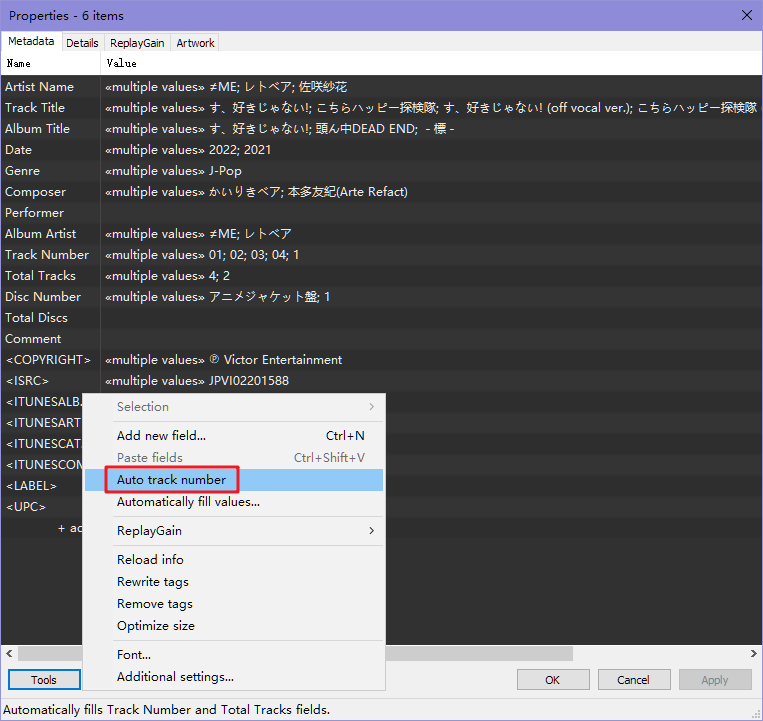

6. 编辑好 Metadata 之后, 还需要检查封面, 点击 Properties 界面的 `Artwork` 选择卡  
    对于分轨歌曲, 一般我们只在 Front Cover 嵌入封面, 如需更换封面需要点击最右列的 `×`, 然后点击第二列的 `+` 选择替换封面  
    对于整轨歌曲, 需要保证这里没有嵌入任何封面

    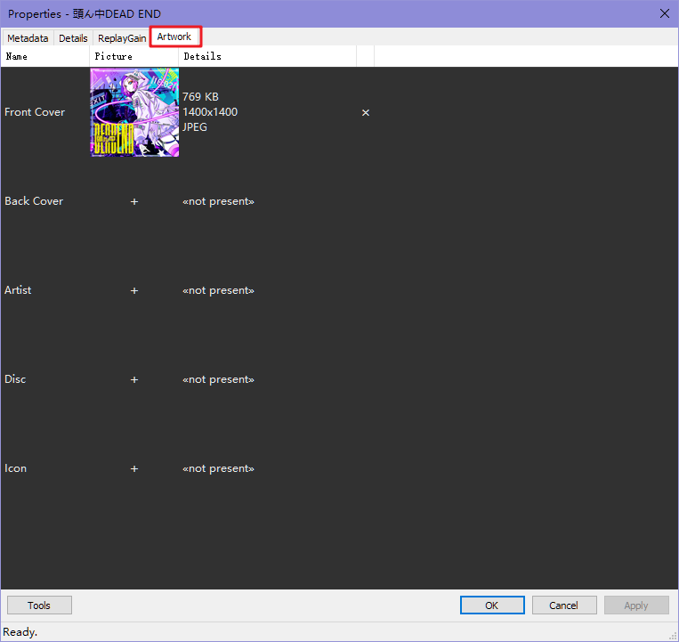

7. 点击 `ReplayGain` 选择卡, 确认各曲目**没有**指定 ReplayGain 信息

8. 最后点击 `OK` 保存, 完成编辑

#### 备注

完成编辑后, 建议重新进入 Properties 界面复核 Metadata 修改是否保存成功

部分由 FFmpeg 植入的数据需要经过一次转码后才能编辑删除, 直接编辑原档是删不掉的

### 比较音轨

foobar2000 可以按位去比较两端音频的异同, 方法非常简单: 选择两个音频, 右键 [`Utilities`] > [`Bit-compare tracks...`]  
一般会有以下几种情况:

- All tracks decoded fine, no differences found.  
    两个音轨完全相同, 但这并不表明这两个音轨的来源相同
- Differences found in compared tracks; the tracks became identical after applying offset and truncating first/last samples.  
    两个音轨在偏移之后完全相同, 表明这两个音轨的来源不同, 一般 CD 和流媒体音源之间会有这种情况
- Differences found in compared tracks.  
    两个音轨完全不同

### 移除内嵌播放列表

有时会遇到内嵌播放列表的音频文件, 表现为单独的文件, 拖进 foobar2000 中显示为多个分轨; 对于 FLAC 和 ALAC (m4a) 的处理方法略微有所不同.

1. 安装播放列表导出插件 [foo_cuesheet_creator](https://foobar.hyv.fi/?view=foo_cuesheet_creator)

2. 在设置中确认这几个选项已打开: `Remove embedded cuesheet(s)`, `Strip chapters ...`, `Save as cuesheet`

    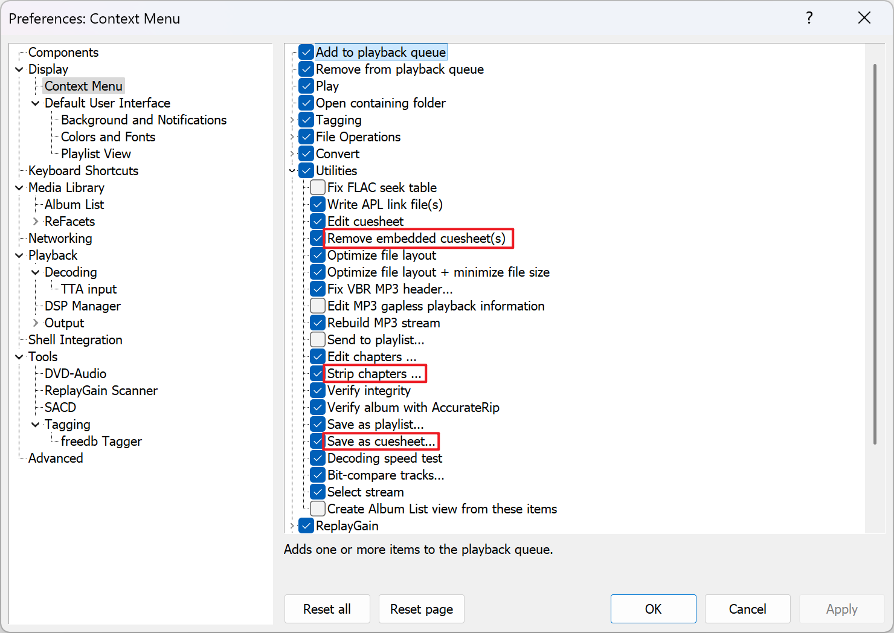

3. 选择该文件的所有分轨, 右键 [`Utilities`] > [`Save as cuesheet`], 以导出 cue 文件

4. 对于 FLAC 文件, 右键 [`Utilities`] > [`Remove embedded cuesheet(s)`]  
    对于 ALAC (m4a) 文件 [`Utilities`] > [`Strip chapters ...`]  
    这是因为 m4a 文件中的播放列表是以章节的形式保存, 所以处理方式有所区别

5. 通过以上步骤可以得到 cue 列表和整轨文件, 正常处理即可, 不要忘记修改 cue 文件中的音频文件名称

### TAK 解码

少数情况下, 会遇到 TAK 编码的音频; 对于使用 TAK1.0 编码音频, 可能会出现无法正常解码 (`Decoding failure`) 的情况, 需要额外安装插件: [foo_input_tak](https://www.foobar2000.org/components/view/foo_input_tak)
