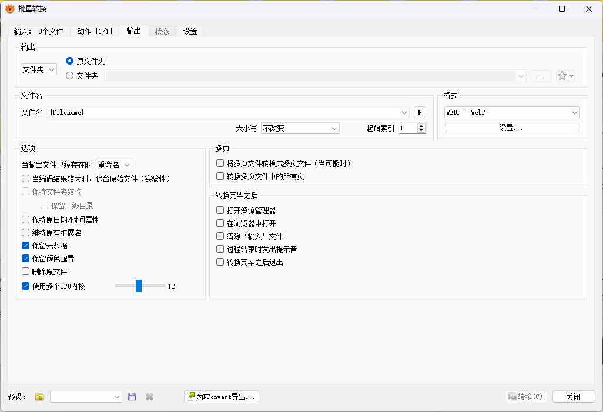
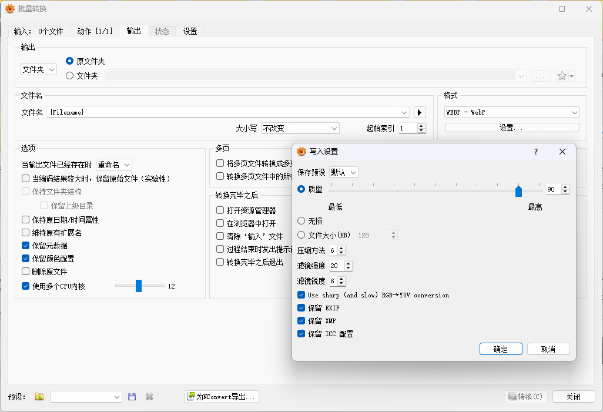
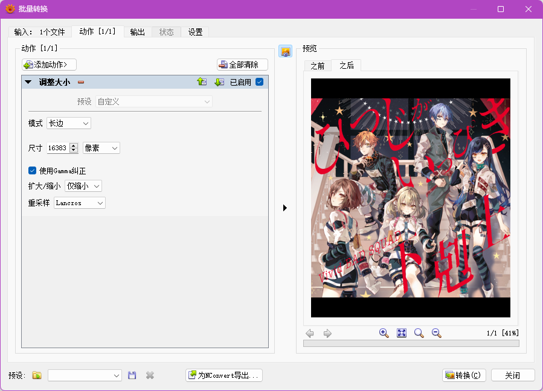
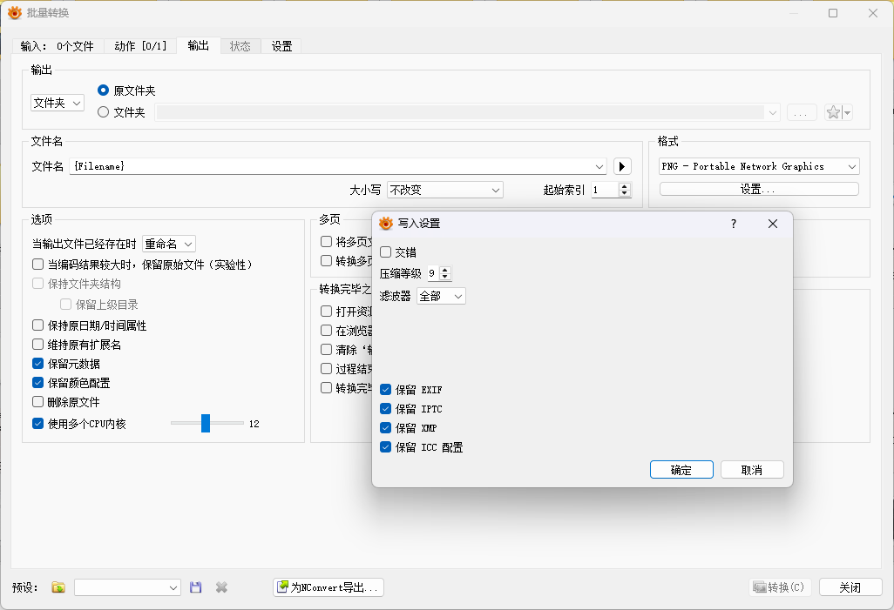

# XnView MP 批量转换图片格式配置教程

## 配置及使用步骤

1. 从 [XnView MP 官网](https://www.xnview.com/en/xnviewmp/#downloads) 下载并安装最新版.

2. 打开 XnView MP 后, 在上方菜单选择 [`工具`] - [`批量转换`], 进入配置页面.

3. 配置页面上方菜单选择 [`输出`] 栏, 上方可选择输出文件夹, 左侧是通用配置, 右上 [`格式`] 部分可对每种目标格式进行详细配置.  
    按如下方式配置通用部分, 注意输出策略选择 [`替换`] 时, 尽量不要输出到原文件夹.

    

4. 使用时, 在 XnView MP 左侧树状浏览器找到目标文件夹, 主界面批量框选待转换图片, 右键选择 [`批量转换`] 进入配置页面, 选择预设的目标格式进行转换; 也可以打开 [`批量转换`], 在它的输入页面直接把需要转换的文件夹或图片拖进去.

## 转 WEBP 配置

WEBP 支持的最大边长为 16383px, 而扫图经常会遇到超出尺寸的原图, 对于这种情况我们需要重新采样最长边到 16383px.

在 XnView MP 中我们通过加入一个常驻的 [`动作`] 设置来实现自动识别超长图片并缩小的功能.  
在 [`批量转换`] 页面, 上方菜单选择 [`动作`] 栏, 选择 `添加动作` - `变换` - `调整大小`, 然后按下图配置.  
注意一定要选择 `仅缩小`, 这样缩放只会在图像大于 16383px 时生效; `使用Gamma纠正` 也要勾选.

## 转最高压缩 PNG 配置

转 PNG 并不受最大边长 16383px 的限制, 因此要确认转换时缩小动作是不生效的 (大于 16383px 时手动关闭 [`动作`] 功能).

> 在我们的使用场景中, 转 PNG 时基本不会出现这种超大图片
