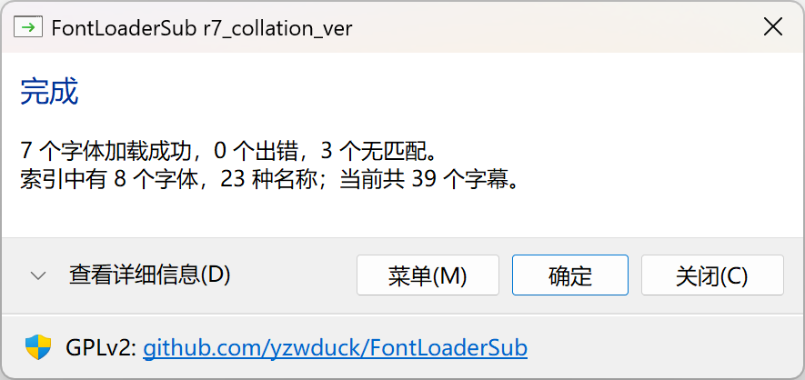
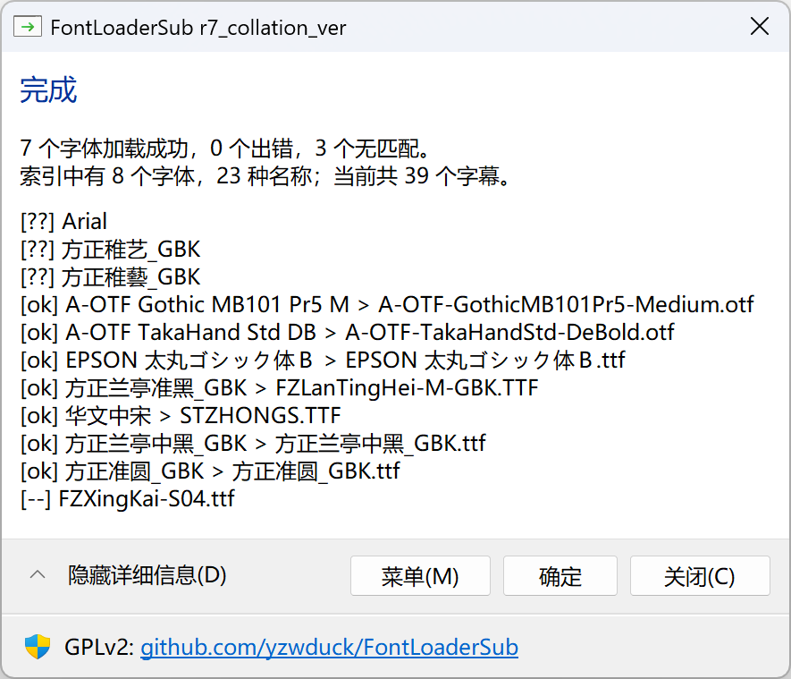
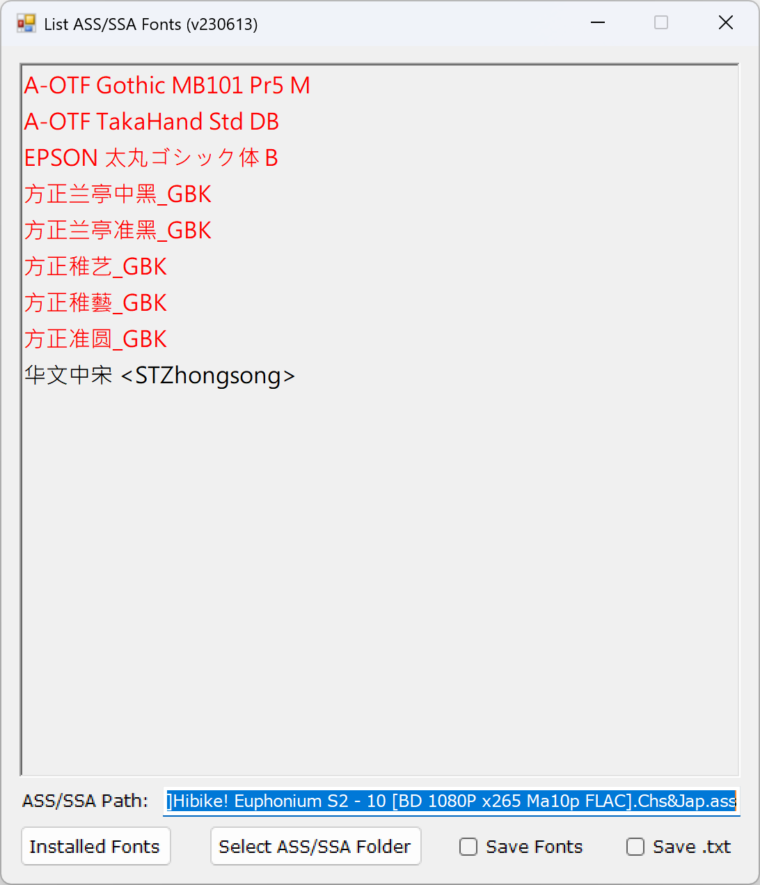
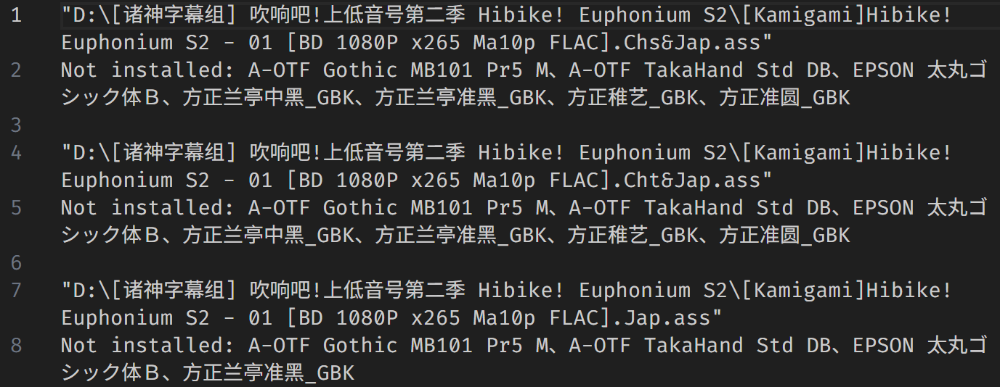
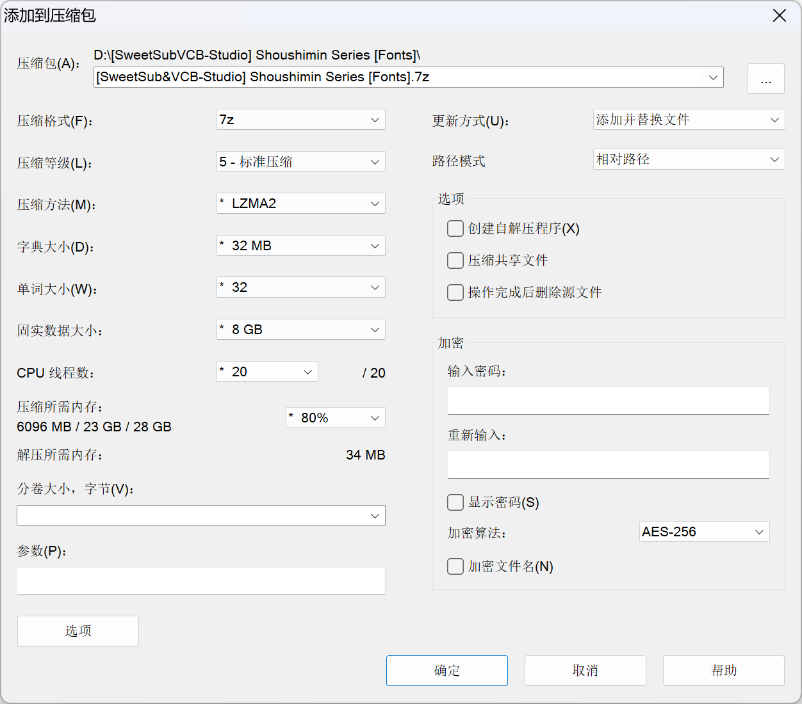

# 字幕和字体包检查规范

字幕和字体包的权利属于字幕组, 由字幕组负责管理和维护. 除命名和删除无用字段外, 其他所有修改均需报告字幕组, 由字幕组处理, 严禁私自修改字幕

通常与字幕组的联络由项目总监负责, 因此字幕相关问题都联系总监协调并交由字幕组处理

## 字幕检查

* 内容

  确保字幕文件播放正常, 和画面内容相符, 时间同步  
  确保简繁体字幕内容匹配, 简体字幕里没有出现繁体内容, 反之亦然  

* 格式

  编码格式: **UTF-8 with BOM**  
  换行格式: **CRLF**  
  > 可使用 VSCode 查看字幕的格式

* 无用字段

  字幕文件中可能存在一些无用的字段, 它们由制作字幕的软件产生, 和字幕内容无关, 可能透露制作者的个人信息, 应当删除

  `[Aegisub Project Garbage]` 和 `[Aegisub Extradata]` 字段应当删除

* 制作信息

  通常字幕组会在字幕正文中 (`[Events]` 部分) 写上制作人员的信息, 其中如果有**压制**职位, 应当要求改为 `VCB-Studio` 或者删除该职位, 如果没有该职位不用要求添加

  注意该修改需要报告字幕组, 由字幕组完成

* 其他问题

  如果发现字幕存在明显的翻译/时轴/缺漏或其他问题, 鼓励报告给字幕组后进行修正

## 字体包检查

ASS 字幕中会引用不同的字体样式, 如果播放渲染时没有安装对应的字体, 就会导致缺字错乱等问题  
我们需要对字体包进行检查, 保证字体包覆盖字幕使用的全部字体, 数量不重不漏

ASS 字幕中样式的定义和实际使用是分开的, 这意味着制作者可以定义一部分样式, 但最终并不使用它们  
这些定义但未使用的样式, 即使没有安装对应字体, 也不会影响播放效果

我们主要使用两个工具对字体包进行检查, [FontLoaderSub_r7_collation_ver](https://github.com/lapluis/FontLoaderSub/releases/tag/r7_collation_ver) (以下简称为 FontLoaderSub) 和 [ListAssFonts](https://bbs.acgrip.com/thread-1894-1-1.html)  
这两个工具检查的严格程度不同, 因此对于检查结果有不同的要求

### FontLoaderSub

FontLoaderSub 可以分析字幕使用的字体, 并临时挂载, 我们使用的魔改版只对当前目录下的字体进行检测, 可以避免系统已安装字体的影响  
FontLoaderSub 对定义的所有样式进行检测, 因此对于定义了样式但实际不使用的字体, 它也会报出字体缺失

* 将字幕和字体解压到同一个目录, 然后把 FontLoaderSub.exe 也复制过去

* 把字幕拖到 exe 上, 程序会自动读取当前目录下的字体, 并且加载 ASS 字幕中需要的字体, 点击 **查看详细信息** 即可显示字体加载状态

  

  * `[??]` 为是没找到相应的字体

  * `[ok]` 为正确加载的字体

  * `[^ ]` 表明该字体名称与其他名称指向同一个文件
  
  * `[--]` 为目录下存在但未使用的字体
  
  * `[ X]` 表示加载错误
  
  注: 程序会在当前目录生成一个 `FontLoaderSub.log`, 方便复制对比

### ListAssFonts

ListAssFonts 的分析更加精准, 只会显示出实际使用的字体  
但是 ListAssFonts 不能指定字体目录, 也不能检测 FontLoaderSub 临时挂载的字体, 它只能检查系统已安装的字体  
ListAssFonts 还会同时检查字幕中的错误, 比如样式的语法、字体是否缺字等

* 将字幕 (或者所在目录) 拖到程序上即可, 需要确认程序中显示的字体和字体包中的是一一对应的

  其中黑色是系统已安装的字体, 红色是未安装的字体, 蓝色是已安装但可能有显示问题的字体, 粉色是未安装但可能有显示问题的字体  
  只需确认列举的字体和字体包对应, 对于可能有显示问题的警告可忽略

* 工具还会在字幕目录下生成一个 `NeedVerify.txt` 文件, 记录缺失字体以及字幕中存在的错误

### 字体检查要求

* **基本要求**是确保 ListAssFonts 检查出的字体与字体包之间能够一一对应
* **更高的要求**是确保 FontLoaderSub 的检测结果也与 ListAssFonts 检查出的结果一致  
  如果不一致说明存在定义但未使用的字体, 可联系字幕组删除这些没用到的样式  
* 对于在检测过程中遇到的错误, 应及时向总监报告, 反馈给字幕组进行修复  
  但并非所有反馈都会被接受, 若未被接受, 可忽略处理, 毕竟字幕的制作并不由我们负责

## 字体包打包

使用 `7-Zip` 软件打包, 打包格式为 `7Z`  
字体打包时选择所有字体进行打包, **不要含有目录**  
压缩等级至少选择 `5 - 标准压缩`  

